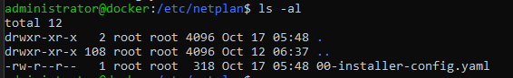
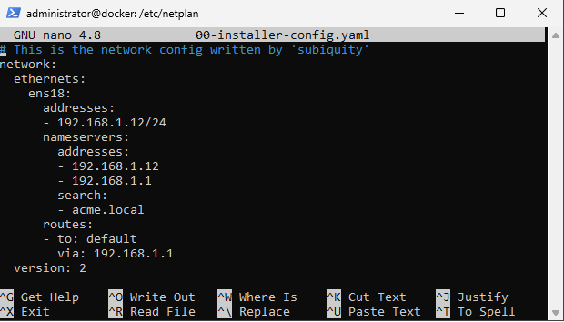
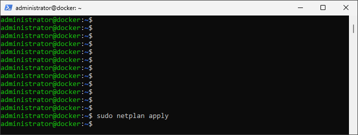

# Change DNS server(s)

1. Go to the Netplan directory:    
    
````    
cd /etc/netplan
````

2. List the yaml files
````    
ls -al
````


3. Open the yaml file and edit the nameserver addresses
````
nano 00-installer-config.yaml
````


4. Apply the settings with the ````sudo netplan apply```` command

